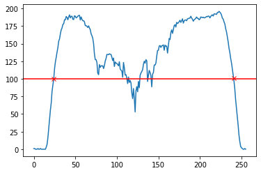
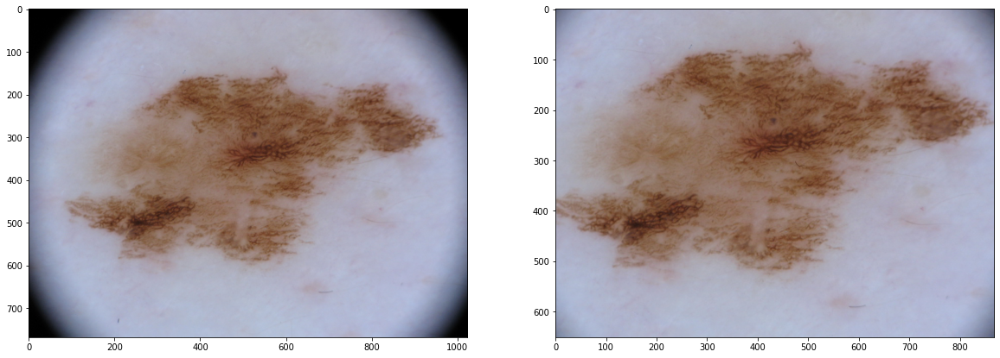
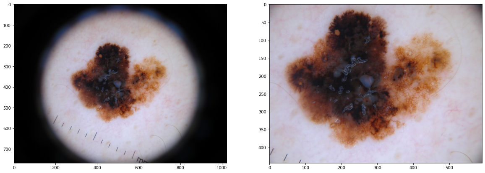
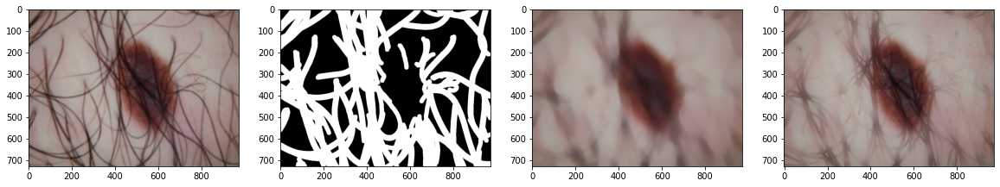
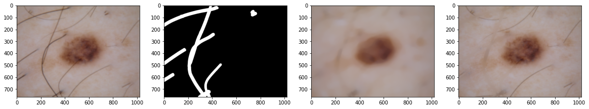
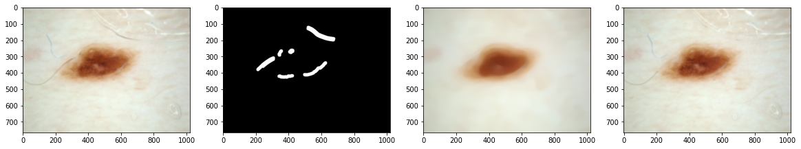
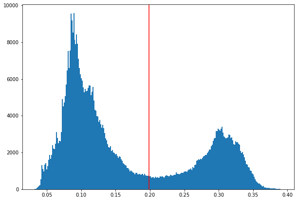
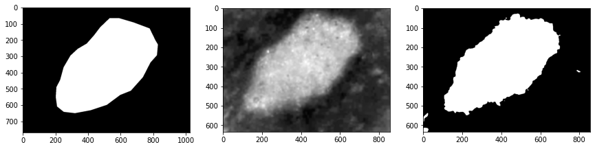
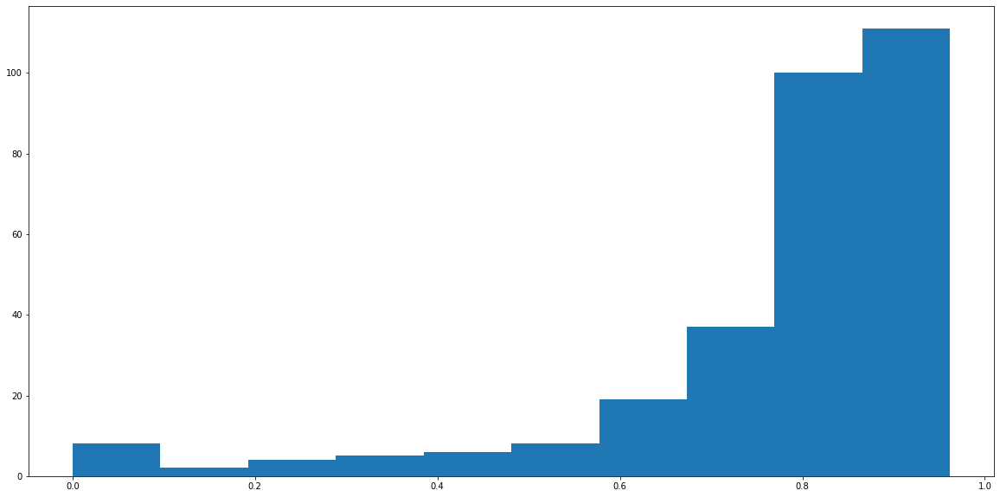
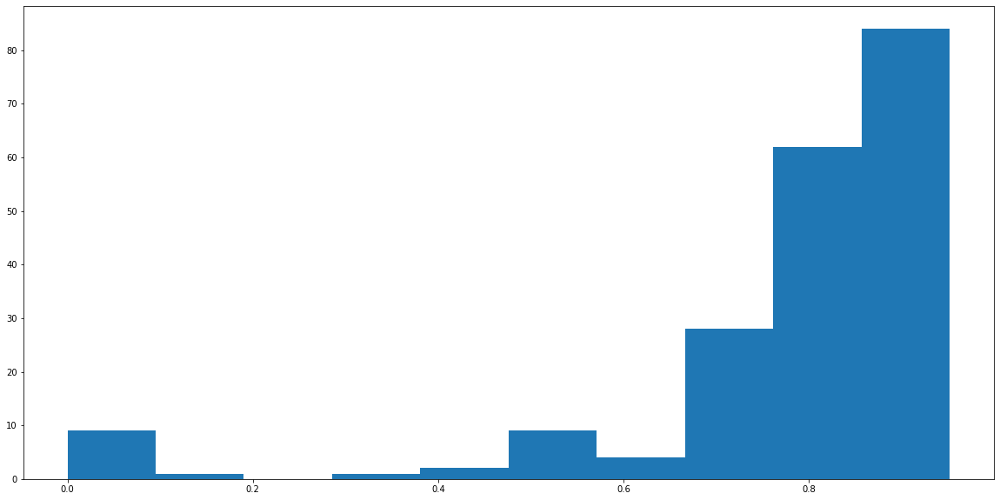

# Skin lesion segmentation
Melanoma is the most common type of skin cancer and dermoscopy images the most non-
invasive imaging techniques for diagnosing. The automatic processing of these images
allows us to segment the image and analysis the skin lesion.

**This project has been made to compete on UC3M [Kaggle competition](https://www.kaggle.com/c/bip-segmentation-project-2020/leaderboard)**

For this project, a total of 300 images from the [ISIC](https://www.isic-archive.com/#!/topWithHeader/wideContentTop/main) file of skin lesions with their 
respective ground truth mask have been used to develop a segmentation algorithm. To
evaluate the algorithm a set of 200 images without the ground truth mask have been 
used.

The algorithm is structured in three steps: pre-processing, segmentation, and 
post-processing. The code has been developed in a python notebook with the tool 
Google Colaboratory to work on the cloud easily and then converted to python script.

## Preprocessing
The pre-processing step is quite simple, it only has three steps.
1. Vignette removal
2. Gaussian filter
3. Hair removal

The first step is removing the vignette that some images have by cropping the image 
to get only the region of interest (without the vignette). This process is detailed 
in the sections below. Then, a gaussian filter is performed over the cropped image, 
with a sigma of 3. This value allows us to blur the artifacts of the image but keeps 
the important edges. Finally, a filtering process to remove the hair is applied. This 
filtering process is detailed below.

### Vignette removal
Some images have a circular vignette that downgrades the performance of the 
segmentation, so is important to remove it before any segmentation process. To do 
this, I check the diagonal of the image, from the pixel 0,0 to the pixel 768,1024 and 
get the mean value of the three channels of these pixels (blue line). The 
values are stored to compare it after with a threshold (red line). The 
algorithm search for the first and the last position where the mean value of the 
pixels is higher than the threshold (red crosses). 

With this information, we know where the points in the diagonal of the image are 
where the vignette starts and ends. Then, the image is cropped by these points. The 
algorithm checks both diagonals and crops the image by the most restrictive points. 
This ensures that the region of interest is correct although the vignette is not 
centred.

  

  
  

### Hair removal
Hair is the main artifact of the skin images, and when it has enough thickness could downgrade
the performance of the segmentation, so is important to remove or reduce its presence in the
image. The designed algorithm follows the steps below:
1. Extract the edges of the image with a Canny algorithm.
2. Compute the hair index (ratio of the edges presence in the mask).
3. If the hair index is higher than 2:
    1. Compute a median filter over the RGB image.
    2. Multiply the median filtered image by the edges mask, to get the value of the
pixels only in the mask.
    3. Compute the maximum to replace the pixels of the hair in the original image
by the median value.

  
  

We can see how the
edges mask gets well the hair and other artifacts like the gel used for this technique. When the
hair is abundant the result is not perfect but is an improvement with respect to the original
image. Another algorithm for hair removal from the bibliography has been tried but without
good results, detailed in the failed approaches section.

## Segmentation
The segmentation is the core part of the process. On a first approach I have tried to convert the
image to gray-scale and then compute the segmentation, but the illumination artifacts normally
downgrade the performance of the segmentation. 

Instead of the gray-scale I have chosen the
HSV format to compute an Otsu thresholding algorithm. The HSV format splits the image into
hue, saturation, and value. The saturation channel shows the “intensity” of the color. Saturation
is in general not affected by the illumination artifacts and the saturation of the melanoma and
the skin has in general enough difference, so in probably the best channel to perform the
thresholding.

In the image below we can see the histogram of the saturation channel on an image that in gray-scale
has illumination artifacts. We can see how this kind of artifacts does not affect the thresholding
which gets an almost perfect mask. The performance of the Otsu
thresholding over the saturation channel is shown in the image below.
Another algorithm for segmentation based on clustering has been tried in combination with the
thresholding but without good results. This approach is detailed in the failed approaches section.

  
  

## Post-processing
The post-processing step is to focus on correct the mask obtained by the segmentation step.
This step is compound by:
1. Filling the holes of the mask.
2. Morphological opening (erode and dilation).
3. Label the mask and calculate the properties of the regions.
4. Select only the region with the nearest centroid to the centre of the image.
5. Enlarge the mask and make it more polygonal (dilation and convex hull).
6. Recover the original shape of the image.

The post-processing step starts with a fill holes operation which merges the regions inside
another region in one. This ensures that the final mask is a region without holes. Then, an erode
and dilation with the same kernel is performed to remove small artefacts (like gel or hair not
removed by the pre-processing step). The next step is to label the regions of the mask and gets
its properties.

Normally the segmentation is not perfect as there are images very difficult to segment, so the
resulting mask could have more than one region. To solve that, the nearest region to the centre
of the image is selected as we know that the skin lesion is centred in the image. The distance is
calculated as the Euclidian distance between the centre of the image and the centroid of the
region.

Finally, as we know that the skin lesion normally has a margin over its “limit”, the final mask is
enlarged to give it this margin. The enlarge operation is compound by a dilation operation and
a convex hull operation, which “polygonise” the mask. This operation enlarges the mask at the
same time that simplifies its shape. To finish, as in the pre-processing step we crop the image,
now we must recover the original size of the mask to be able to compute the Jaccard index and
to have a corrected placed mask.

## Evaluation of the results
In the plots and metrics below, we can see some information about the obtained results. The
metric to measure the performance of the whole process is the Jaccard index which has a value
between 0 and 1. We can see that in the training set (composed by 300 images) the proposed
solution gets a mean Jaccard index of 0.77, but with a median of 0.84. This means that some
predicted masks have a bad score but in general, most of the mask has a good score of around
0.84. Some images are difficult to segment, so excluding these ones, the proposed solution has
a really good performance. 

The most important is that in the test set the proposed solution gets almost the same score as
in the training set. This means that the implemented algorithm does not depend on the set of
the images and it has the ability to generalize. Some very difficult images downgrade the mean
of the test scores, but we can see the vast majority are over 0.6.
- Mean of scores (train): 0.7763
- Median of scores (train): 0.8434
- Standard deviation of scores (train): 0.1967

  

- Mean of scores (test): 0.7745
- Median of scores (test): 0.8400
- Standard deviation of scores (test): 0.2007

  

